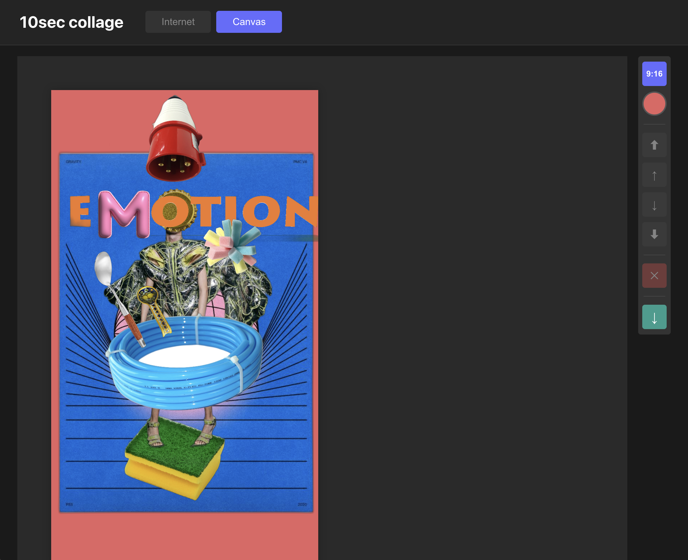

# 10sec collage

Web-based collage app with AI background removal.



## Features

- **Internet Image Search** - Search and import images from the web
- **AI Background Removal** - Automatically remove backgrounds using rembg
- **Canvas Editor** - Drag, resize, rotate images with Konva.js
- **Aspect Ratios** - Presets for 1:1, 9:16, 16:9, 3:4, 4:3, 2:3, 3:2
- **Color Picker** - HSL color wheel for artboard background
- **Z-Order Controls** - Arrange layer order
- **PNG Export** - Download your collage as PNG

## Stack

- **Frontend**: React + TypeScript + Vite + Konva.js
- **Backend**: Python + FastAPI + rembg

## Setup

### Backend

```bash
cd server
python -m venv .venv
source .venv/bin/activate
pip install -r requirements.txt
python main.py
```

### Frontend

```bash
cd frontend
npm install
npm run dev
```

Open http://localhost:5173

## Usage

1. Go to **Internet** tab
2. Search for images
3. Select an image and click **Use** to auto-remove background
4. Switch to **Canvas** tab
5. Arrange your collage
6. Click export button to download PNG
